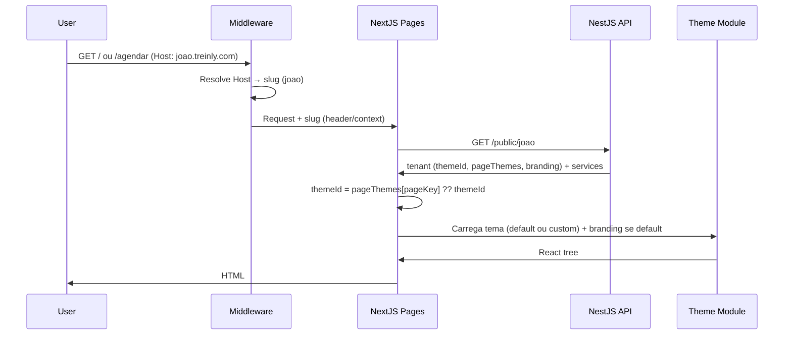
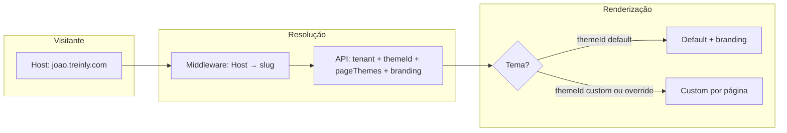

# Temas do hotsite (Opção A + customização por página)

Documento de referência: como gerenciar temas do hotsite do profissional com suporte a **customizar somente uma página** (ex.: só perfil ou só agendar).

## Decisão

- **Opção A:** Temas como módulos no mesmo app Next.js.
- **Extensão:** Override **por página** — o tenant pode usar o tema padrão na maior parte e customizar apenas uma rota (ex.: só a página perfil).

## Dois modos de customização do hotsite

### 1. Tema default + branding (imagens, fontes, cores)

A maioria dos profissionais usa o **mesmo código** do tema default, com customização **apenas visual**:

- **Imagens:** logo, imagem de capa/hero, favicon, etc. (URLs ou IDs de mídia).
- **Fontes:** família do título, do corpo; pode ser Google Fonts ou similar.
- **Cores:** primária, secundária, fundo, texto (ex.: variáveis CSS ou tokens).

Não há outro tema nem código novo: o tema **default** recebe um objeto de **branding** por tenant (vindo da API) e aplica esses valores (ex.: CSS variables no layout, `` com URL do logo, `font-family` injetado). O layout e a estrutura das páginas permanecem iguais.

- **Persistência:** config de branding no tenant (ex. `public_branding` JSON ou campos dedicados: `logo_url`, `hero_image_url`, `primary_color`, `font_heading`, `font_body`, etc.). API `GET /public/:slug` retorna esse objeto para o front aplicar no tema default.

### 2. Tema 100% custom (código diferente)

Quando imagens/fontes/cores não bastam, o profissional pode usar um **tema com código próprio** (layout e páginas diferentes), conforme já documentado: `public_theme_id`, `public_page_themes`, módulos em `themes/<id>/`.

**Resumo:** default + branding = só dados (branding config). Tema custom = outro código (módulo de tema). Um tenant pode usar só branding (themeId = default + branding), ou um tema custom (com ou sem override por página).

## URLs públicas (o que o visitante vê)

As rotas do hotsite **não** expõem o slug na URL. Cada profissional tem **subdomínio** ou **custom domain**:

- **Subdomínio:** `https://joao.treinly.com/` (perfil) e `https://joao.treinly.com/agendar` (agendar).
- **Custom domain:** `https://joao-personal.com/` e `https://joao-personal.com/agendar`.

Na URL do visitante aparecem apenas **/** e **/agendar** (e futuras rotas como /sobre), nunca `/joao` ou `/joao/agendar`. O tenant é resolvido pelo **host** da requisição, não por um segmento de path.

## Resolução do tenant (host → slug)

- **Middleware (ou edge):** Antes de servir a página, o app resolve o tenant a partir do `Host` da requisição:
  - **Subdomínio:** ex. `joao.treinly.com` → slug = `joao` (convenção: primeiro subdomínio).
  - **Custom domain:** lookup em tabela (ex. `tenant_custom_domains`: host → tenant_id/slug) ou cache; o domínio do profissional aponta para o mesmo app (DNS CNAME ou proxy).
- O slug resolvido é passado para as páginas via header, cookie ou context (uso interno); a API continua sendo chamada com esse slug (ex. GET `/public/:slug`).

## Resolução de qual tema usar em cada rota

- **Tema base:** `public_theme_id` (ex.: `"default"`) — usado para todas as páginas quando não houver override.
- **Override por página:** `public_page_themes` (JSON), ex.: `{ "profile": "custom-acme" }`. Chaves são identificadores de página: `profile`, `agendar` (no futuro: `sobre`, `contato` etc.).
- **Regra:** Para a rota atual, `themeId = public_page_themes[pageKey] ?? public_theme_id`.

Exemplos:
- Tenant com tema base `default` e sem overrides → página `/` (perfil) e `/agendar` usam tema `default`.
- Tenant com tema base `default` e `pageThemes: { "profile": "custom-acme" }` → `/` usa `custom-acme` (perfil), `/agendar` usa `default` (agendar).
- Tenant com tema base `custom-acme` e sem overrides → todas as páginas usam `custom-acme`.

Assim é possível customizar **somente uma página** sem duplicar o resto do tema.

## Roteamento e estrutura no Next.js (apenas interno)

As URLs públicas são `/` e `/agendar` no domínio do profissional; o slug não aparece na URL. No app:

- **Rotas internas:** `app/(public)/page.tsx` (perfil) e `app/(public)/agendar/page.tsx` (agendar). Não usar segmento `[slug]` no path — o tenant vem do host, resolvido no middleware.
- **Middleware:** Resolve Host → slug (subdomínio ou custom domain); injeta slug (ou tenant_id) em header/context para as páginas.
- **SSR:** Cada página obtém o slug do contexto (definido pelo middleware), chama `GET /public/:slug`, recebe `tenant` (themeId, pageThemes) e `services`; resolve `themeId` efetivo para o `pageKey` atual e carrega o componente do tema (ex.: `themes/custom-acme/ProfilePage.tsx`).

## Estrutura de temas

- `themes/default/` — tema padrão: `ProfilePage`, `AgendarPage` (ou referência ao wizard compartilhado).
- `themes/<custom-id>/` — pode exportar **apenas as páginas que customiza** (ex.: só `ProfilePage`). Páginas não implementadas usam fallback do tema base (convenção: se não existir `ProfilePage.tsx` no tema, usa-se o tema base para essa página).
- **Contrato por página:** Cada tema que implementa uma página exporta um componente com props definidas:
  - Perfil: `{ tenant, services }`
  - Agendar: `{ tenant, services, slug }`

## Persistência (modelo de dados)

- **Tenant:**
  - **Tema:** `public_theme_id` (string, default `"default"`). Opcional: `public_page_themes` (JSON), ex.: `{ "profile": "custom-acme" }`.
  - **Branding (tema default):** `public_branding` (JSON) ou campos dedicados para customização visual quando o tema for default: imagens (ex. `logo_url`, `hero_image_url`, `favicon_url`), fontes (ex. `font_heading`, `font_body`), cores (ex. `primary_color`, `secondary_color`, `background_color`, `text_color`). O tema default lê esses valores e aplica (CSS variables, atributos, etc.).
- API `GET /public/:slug` retorna `tenant.themeId`, `tenant.pageThemes` e `tenant.branding` (ou `tenant.publicBranding`). Quando `themeId === "default"`, o front usa `branding` para estilizar; temas custom podem ignorar ou usar parcialmente.

## Exemplo de resolução (tema por página)

| Tenant config | Página / (profile) | Página /agendar |
|--------------|--------------------|----------------|
| themeId: default, sem overrides | default | default |
| themeId: default, pageThemes: { profile: custom-acme } | custom-acme | default |
| themeId: custom-acme, sem overrides | custom-acme | custom-acme |
| themeId: default, pageThemes: { agendar: custom-wizard } | default | custom-wizard |

## Diagramas

### Fluxo da requisição (subdomínio ou custom domain)

### Modos de customização (visão geral)

## Próximos passos (implementação)

1. **Resolução por host:** Implementar middleware que resolve Host → slug (subdomínio: extrair do host; custom domain: tabela/cache). Definir tabela/campo para custom domains (ex. `tenant_custom_domains` ou campo no tenant) se for suportar domínio próprio.
2. Adicionar no schema do tenant: `public_theme_id` e `public_page_themes`. Incluir na API GET `/public/:slug`.
3. Criar rotas **sem** slug na URL: `(public)/page.tsx` e `(public)/agendar/page.tsx`. Slug obtido do contexto (middleware). Resolver `pageKey` → `themeId` e carregar componente do tema (dynamic import).
4. Implementar tema `default` em `themes/default/` (ProfilePage + AgendarPage ou wizard compartilhado), **parametrizado por branding**: receber `tenant.branding` e aplicar imagens, fontes e cores (ex. CSS variables no layout, logo/hero via URLs do branding).
5. Adicionar no schema e na API o objeto de branding (ou campos) para tema default; painel com edição de logo, cores, fontes (se escopo V1).
6. Documentar interface mínima por página e convenção de fallback. Para primeiro cliente custom: criar `themes/custom-<id>/` e configurar `themeId` / `pageThemes` no tenant.
